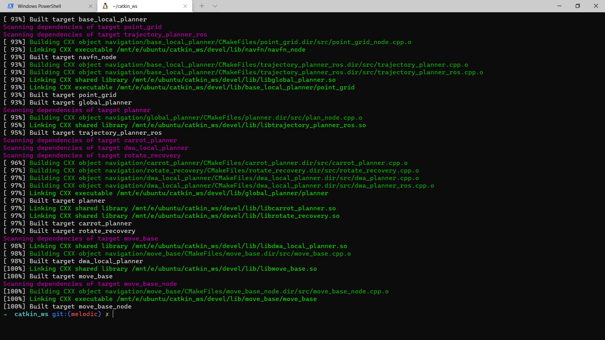
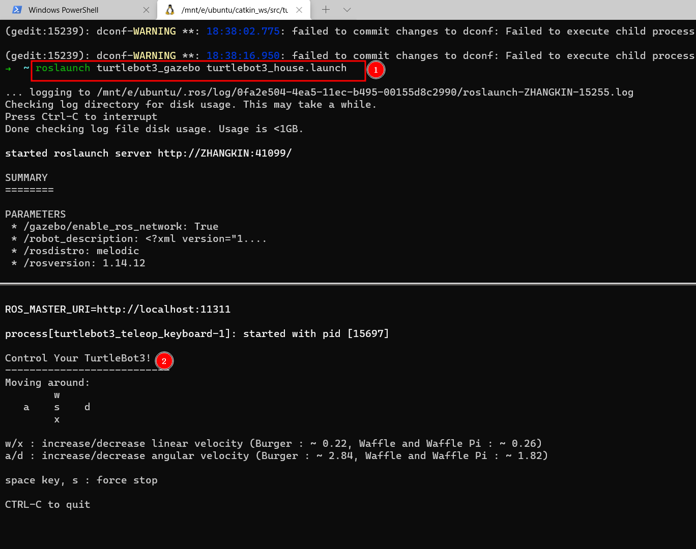
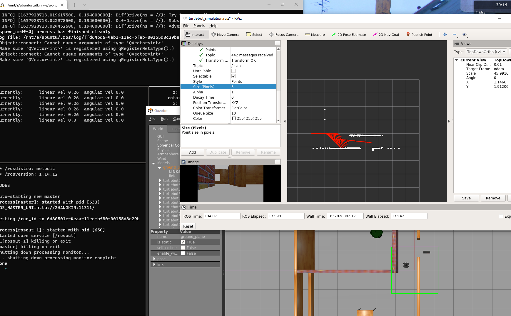

此repo用以ros-melodic在gazebo仿真中的使用，本readme可结合CSDN博客进行共同观看，有些重复的问题我就不在这里复述了：

[【Ubuntu 0】ubuntu与ROS安装系列](https://blog.csdn.net/qq_39537898/article/details/111948612)

# 系统版本

- ROS-Melodic
- Ubuntu-18.04
- Python 2.7

# 参考链接

所有的分支均来源于以下几个git-master基本都是最新版ROS2的了，所以此处当参考链接，不需要在这里 ==**<u>git clone</u>**==

```bash
git clone https://github.com/ros-planning/navigation.git
git clone https://github.com/ROBOTIS-GIT/turtlebot3_msgs
git clone https://github.com/ROBOTIS-GIT/turtlebot3.git
git clone https://github.com/ROBOTIS-GIT/turtlebot3_simulations.git
git clone https://github.com/ros-planning/navigation_msgs.git
git clone https://github.com/ros/geometry2.git
```

# 使用方法

## 1. git clone

首先自己建立自己的workspace，通常catkin_ws，或者叫什么xxx_ws均可，最好单独一个workspace

```bash
mkdir ~/catkin_ws/src
cd ~/catkin_ws/src
```

gitee clone 中国大陆使用：

```bash
git clone https://gitee.com/kin_zhang/turtlebot_simulation.git
```

github clone：

```bash
git clone https://github.com/Kin-Zhang/turtlebot_simulation.git
```

## 2. 编译

首先全新系统的话可能需要安装一下一个系统依赖：

```bash
sudo apt-get install libsdl-image1.2-dev
sudo apt-get install libsdl-dev
```

然后编译：

```bash
catkin_make
```



然后source添加，注意bash和zsh有些许不一样，添加后source一下

```bash
echo "source ~/catkin_ws/devel/setup.bash" >> ~/.bashrc
echo "export TURTLEBOT3_MODEL=waffle" >> ~/.bashrc
source ~/.bashrc
```

zsh用户：

```bash
echo "source ~/catkin_ws/devel/setup.zsh" >> ~/.zshrc
echo "export TURTLEBOT3_MODEL=waffle" >> ~/.zshrc
source ~/.zshrc
```

## 3. 运行

### 仿真世界模型

下面三个launch ==**<u>选其一</u>**==

```bash
roslaunch turtlebot3_gazebo turtlebot3_empty_world.launch
roslaunch turtlebot3_gazebo turtlebot3_world.launch
roslaunch turtlebot3_gazebo turtlebot3_house.launch
```

### 手动操作机器人运行

```bash
roslaunch turtlebot3_teleop turtlebot3_teleop_key.launch
```



实际我看看搞个视频是否ok



### 自动slam建图


### 建图后自主导航

