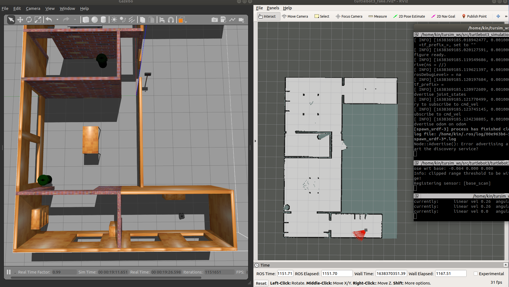
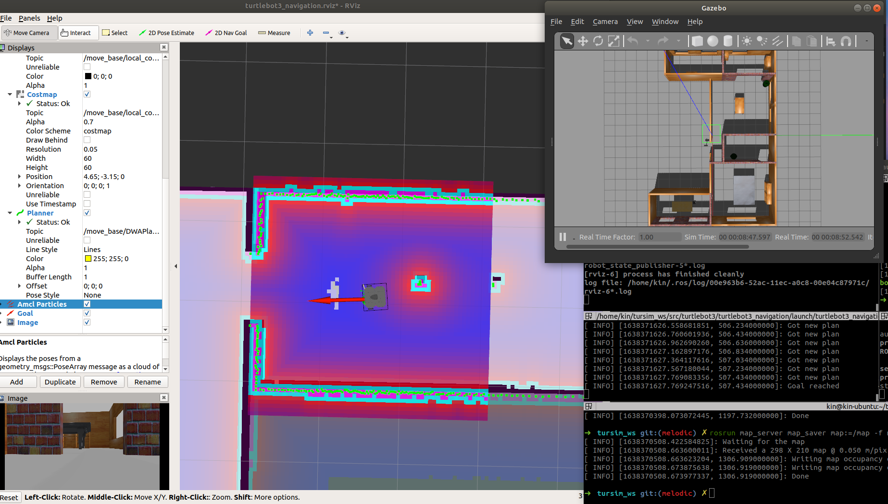

此repo用以ros-melodic在gazebo仿真中的使用，本readme可结合CSDN博客进行共同观看，有些重复的问题我就不在这里复述了：

[【Ubuntu 0】ubuntu与ROS安装系列](https://blog.csdn.net/qq_39537898/article/details/111948612)

# 系统版本

- ROS-Melodic
- Ubuntu-18.04
- Python 2.7

# 参考链接

所有的分支均来源于以下几个git-master基本都是最新版ROS2的了，所以此处当参考链接，不需要在这里 ==**<u>git clone</u>**==

```bash
git clone https://github.com/ros-planning/navigation.git
git clone https://github.com/ROBOTIS-GIT/turtlebot3_msgs
git clone https://github.com/ROBOTIS-GIT/turtlebot3.git
git clone https://github.com/ROBOTIS-GIT/turtlebot3_simulations.git
git clone https://github.com/ros-planning/navigation_msgs.git
git clone https://github.com/ros/geometry2.git
```

# 使用方法

## 1. git clone

gitee clone 中国大陆使用：

```bash
git clone https://gitee.com/kin_zhang/turtlebot_simulation.git
```

github clone：

```bash
git clone https://github.com/Kin-Zhang/turtlebot_simulation.git
```

==修改一下文件夹名字 tursim_ws==，进入文件夹

```bash
cd tursim_ws
```

## 2. 编译

首先全新系统的话可能需要安装一下一个系统依赖：

```bash
sudo apt-get install libsdl-image1.2-dev libsdl-dev libsuitesparse-dev
```

然后编译：

```bash
catkin_make
```


然后source添加，注意bash和zsh有些许不一样，添加后source一下

```bash
echo "source ~/catkin_ws/devel/setup.bash" >> ~/.bashrc
echo "export TURTLEBOT3_MODEL=waffle" >> ~/.bashrc
source ~/.bashrc
```

zsh用户：

```bash
echo "source ~/tursim_ws/devel/setup.zsh" >> ~/.zshrc
echo "export TURTLEBOT3_MODEL=waffle" >> ~/.zshrc
source ~/.zshrc
```

## 3. 运行

### 仿真世界模型

下面三个launch ==**<u>选其一</u>**==

```bash
roslaunch turtlebot3_gazebo turtlebot3_empty_world.launch
roslaunch turtlebot3_gazebo turtlebot3_world.launch
roslaunch turtlebot3_gazebo turtlebot3_house.launch
```

### 手动操作机器人运行

```bash
roslaunch turtlebot3_teleop turtlebot3_teleop_key.launch
```

这一步需要给那个文件权限chmod +x

```bash
sudo chmod +x ~/tursim_ws/src/turtlebot3/turtlebot3_teleop/nodes/turtlebot3_teleop_key
```


实际我看看搞个视频是否ok


### slam建图

#### auto run

待写

#### 手动控制

手动的意思呢 就是需要自己控制车辆开，大致效果如下图，需要运行的command

1. 需要开启一下gazebo和fake_node，就是假装一下有个车 和有 tf树

    ```bash
    roslaunch turtlebot3_gazebo kinadd.launch
    ```

2. 建图launch 本分支使用的是karto，也可gmapping 需要自行clone代码进行

   ```bash
   roslaunch turtlebot3_slam turtlebot3_karto.launch
   ```



在建立完成后，需要进行保存操作，保存后需要自己移到navigation下，注意查看yaml文件中第一行路径是否ok

```bash
rosrun map_server map_saver map:=/map -f map_x
```

- [ ] TODO写到launch 按键保存

### 建图后自主导航

1. 需要开启一下gazebo和fake_node，就是假装一下有个车 和有 tf树

   ```bash
   roslaunch turtlebot3_gazebo kinadd.launch
   ```

2. 注意修改map files从哪里获取的

   ```bash
   roslaunch turtlebot3_navigation turtlebot3_navigation.launch
   ```

   也就是launch中的这一行

   ```bash
   <arg name="map_file" default="$(find turtlebot3_navigation)/maps/map_test.yaml"/>
   ```


